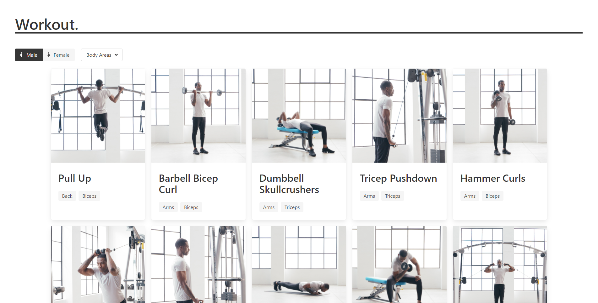
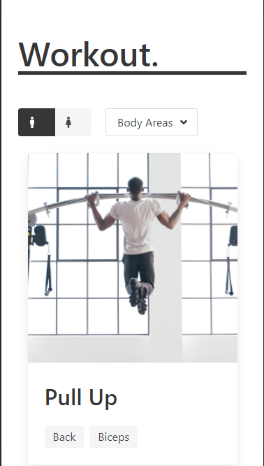
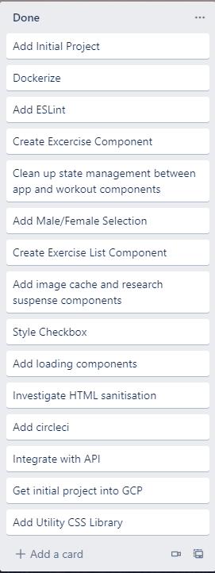
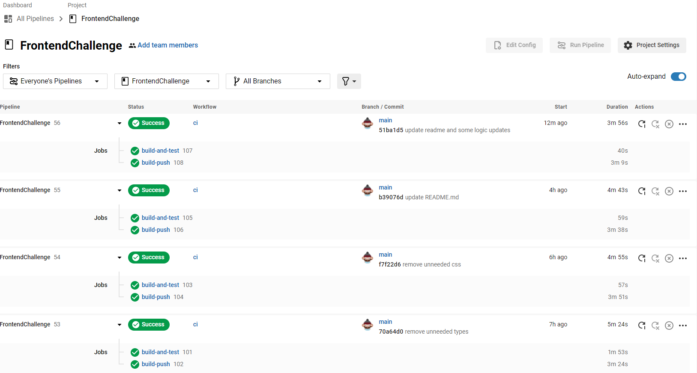

# Frontend Challenge
[](https://circleci.com/gh/ReissJarvis/FrontendChallenge/tree/main)

### Desktop


### Mobile



### URL
https://orb-gcp-cloud-run-uc2x5lyi5q-ey.a.run.app/
# Introduction
"Workout." is a React frontend based application to showcase my ability to:
 * Build responsive web applications with the use of media queries. (Bulma has been used, but is explained why below.)
 * Understand concepts of state management in react.
 * Unit testing
 * Understanding the role in which CI plays in the development ecosystem
 * Containerise production web applications
 * Setup cloud infrastructure to deploy to.

## Installation and Starting

### Dependencies

```npm install```

### Start
```npm start```

## Testing

```npm test```

## Trello
To track the tasks that needed to be done, I used a Trello kanban board to keep track of what needed to be done



## CircleCI
This project will CI into GCP when a commit goes to main. The ci config can be found at: `./circleci/config.yaml`



## GCP (Google Cloud Platform) - Cloud deployed

The Client has been deployed in production mode using local-web-server in SPA mode and deployed to a Cloud run Serverless instance in GCP.
This means that the instance will only be billed during its execution time. Due to the low amount of traffic, The service will be more cost-efficient than if it was running 24/7.

The application is fully agnostic and only the CircleCI deployment will need to be modified 

## Bulma CSS
Used for Utility classes and quicker scaffolding of components

Even though CSS Styling have been used for multi-select and toggle components, implementation has been all my own.
These components could be changed slightly to be more dynamic and be used as shared components.
